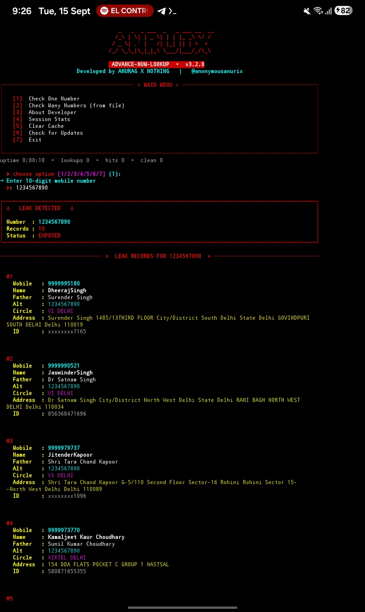

<div align="center">

# 🔥 ADVANCE-NUM-LOOKUP

### 📱 Mobile Number Data-Breach Lookup Tool

**Check whether YOUR OWN mobile number appears in publicly reported data-breach records.**


**Made by ANURAG X NOTHING**

📲 [Telegram](https://t.me/anonymousanurix) •
💬 [Developer Channel](https://t.me/hackedanurag) •
📸 [Instagram](https://www.instagram.com/hackedxanu)

</div>

---

## 🚀 About

**ADVANCE-NUM-LOOKUP** is a Python-based terminal utility for checking whether **your own mobile number** appears in publicly reported data-breach records.

The information returned depends on the available breach data and the service/API response.

> 🔐 **Privacy First:** Use this project only with your own number or with explicit authorization.

---

## ✨ Features

- ⚡ **Fast Lookup** — quickly query available breach records
- 📄 **Record Details** — display available fields returned by the service
- 📦 **Bulk Lookup** — process multiple authorized numbers from a file
- 💾 **Export Results** — save results as JSON and TXT
- 🎨 **Clean Terminal UI** — formatted terminal output
- 📱 **Termux Support** — run on Android without root
- 🐧 **Linux Support** — run on Linux systems
- 📊 **Session Stats** — track activity during the current session

---

## 🖥️ Preview

<p align="center">
  
</p>

---

# 📱 Installation — Termux / Android

### 1️⃣ Update packages

```bash
pkg update -y && pkg upgrade -y
```

### 2️⃣ Install Python & Git

```bash
pkg install python git -y
```

### 3️⃣ Clone the repository

```bash
git clone https://github.com/urcybernothing/ADVANCE-NUM-LOOKUP-.git
```

### 4️⃣ Enter the project

```bash
cd ADVANCE-NUM-LOOKUP-
```

### 5️⃣ Install dependencies

```bash
pip install -r requirements.txt
```

If required:

```bash
pip install requests rich pyfiglet
```

### 6️⃣ Run

```bash
python anurix.py
```

---

# 🐧 Installation — Linux

### 1️⃣ Update system

```bash
sudo apt update && sudo apt upgrade -y
```

### 2️⃣ Install Python & Git

```bash
sudo apt install python3 python3-pip git -y
```

### 3️⃣ Clone

```bash
git clone https://github.com/urcybernothing/ADVANCE-NUM-LOOKUP-.git
```

### 4️⃣ Enter the project

```bash
cd ADVANCE-NUM-LOOKUP-
```

### 5️⃣ Install dependencies

```bash
pip3 install -r requirements.txt
```

### 6️⃣ Run

```bash
python3 anurix.py
```

---

# 🎮 How To Use

Start the tool:

```bash
python anurix.py
```

### Main Menu

```text
╔══════════════════════════════════╗
║       ADVANCE-NUM-LOOKUP         ║
╠══════════════════════════════════╣
║ [1] Check One Number             ║
║ [2] Check Many Numbers           ║
║ [3] About Developer              ║
║ [4] Session Stats                ║
║ [5] Exit                         ║
╚══════════════════════════════════╝
```

### 🔎 Option 1 — Check One Number

Select `1` and enter a mobile number that you own or are authorized to test.

### 📦 Option 2 — Check Many Numbers

Create a file named `numbers.txt` with one authorized number per line, then select option `2`.

### 👤 Option 3 — About Developer

Displays developer information and project channels.

### 📊 Option 4 — Session Stats

Displays statistics for the current session.

### 🚪 Option 5 — Exit

Closes the tool.

---

# 📁 Results & Exports

Results are saved inside:

```text
exports/
```

Depending on the tool response, exports may include:

```text
exports/
├── result.json
└── result.txt
```

View the folder:

```bash
ls exports/
```

---

# 🗂️ Project Structure

```text
ADVANCE-NUM-LOOKUP-
│
├── anurix.py
├── requirements.txt
├── install.sh
├── README.md
├── LICENSE
├── .gitignore
│
└── assets/
    └── preview.png
```

---

# 🔧 Troubleshooting

### `git: command not found`

```bash
pkg install git -y
```

### `python: command not found`

```bash
pkg install python -y
```

### `pip: command not found`

```bash
pkg install python -y
```

### `ModuleNotFoundError`

```bash
pip install -r requirements.txt
```

### Permission denied

```bash
chmod +x anurix.py
```

### Connection error

Check your internet connection and verify that the external service/API used by the project is available.

---

# 🔐 Responsible Use

This project is intended for:

- ✅ Checking your own information
- ✅ Authorized security research
- ✅ Cybersecurity education
- ✅ Personal breach-awareness checks

Do **not** use this project to stalk, harass, doxx, or investigate people without authorization.

> **Always respect privacy, applicable laws, and the terms of the data source/service you use.**

---

# 🌐 Developer

### ANURAG X NOTHING

📲 **Telegram:** [@anonymousanurix](https://t.me/anonymousanurix)

🔥 **Developer Channel:** [@hackedanurag](https://t.me/hackedanurag)

📸 **Instagram:** [@hackedxanu](https://www.instagram.com/hackedxanu)

---

# ⭐ Support The Project

If this project is useful for your authorized security research or learning:

- ⭐ Star the repository
- 🍴 Fork the project
- 🐛 Report bugs through Issues
- 💡 Suggest improvements

---

# 📜 License

This project is released under the **MIT License**.

See [LICENSE](LICENSE) for the full license text.

---

<div align="center">

## 🔥 ANURIX — Where Information Lives

**Cybersecurity • Privacy Awareness • Security Research**

📲 [Join Telegram](https://t.me/anonymousanurix)

**© 2026 ANURIX**

</div>
